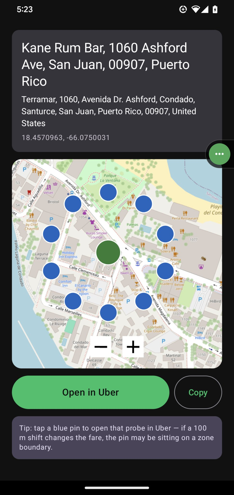
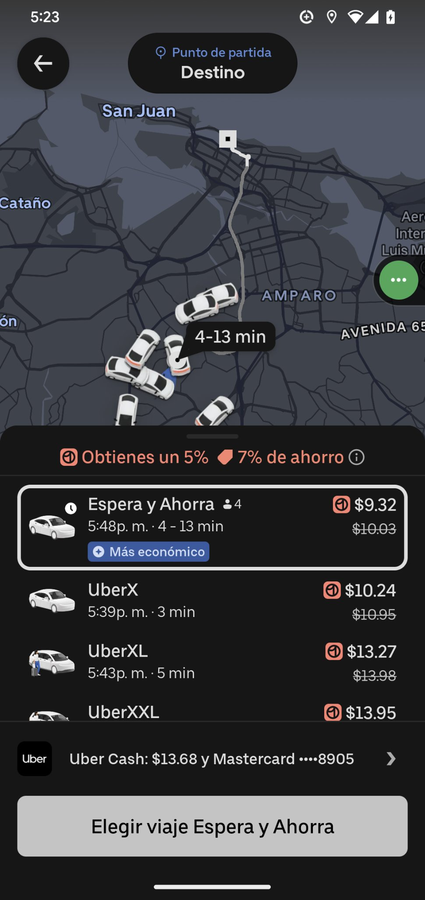
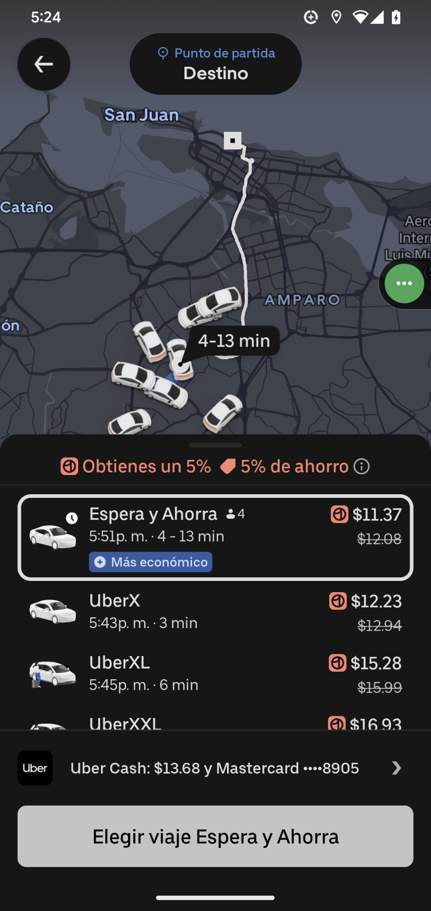

# Maps2Uber (Android)

Native Android port of https://maps2uber.vasilyespana.workers.dev/ — share a Google Maps pin, get Uber deep links.

**What it does:** share a Google Maps pin to the app (or tap a maps link in WhatsApp/Facebook) → the app resolves it via the worker's `/api/resolve` endpoint → produces one Uber deep link to the exact spot **plus 10 probe links on a 100 m circle** to compare fares / detect zone boundaries.

## 💰 Why 100 meters can save you real money

Uber doesn't price your ride by the exact meter — it prices by **zones**. Two pickup points just 100 meters apart can fall on different sides of a zone boundary, and the fare can jump significantly. Move your pin one short block, and the price drops — for the exact same ride.

**There's no inconvenience.** 100 meters is about a one-minute walk. And in practice you don't even have to walk: request from the cheaper pin, then message the driver "I'm right at [your actual spot]" — they drive to you, and the fare stays locked at the cheaper quote. Same car, same destination, lower price.

### How it works

1. Share any Google Maps link to Maps2Uber (or paste it in the app).
2. The app drops a **green pin** on your exact destination, plus **10 blue pins** in a 100-meter circle around it.
3. Tap any blue pin → **Open in Uber** → see the fare for that exact spot.
4. Pick the cheapest pin. Request the ride. Tell the driver where you actually are.

### Real proof — Condado, San Juan

Same evening, same "Espera y Ahorra" service, two pins ~100 m apart near Kane Rum Bar (1060 Ashford Ave):

| | Price | Discount |
|---|---|---|
| Cheaper pin | **$9.32** | 7% off (was $10.03) |
| Pricier pin | **$11.37** | 5% off (was $12.08) |

**$2.05 saved — 22% cheaper — for a one-minute walk.** That's the zone boundary at work.






> **Tip from the app:** tap a blue pin to open that probe in Uber — if a 100 m shift changes the fare, the pin may be sitting on a zone boundary.

## Setup

- JDK 17, Android SDK (platform 34, build-tools 34.0.0)
- Release signing: `release.keystore` + `keystore.properties` (both gitignored, never committed).
  CI restores them from repo secrets: `ANDROID_KEYSTORE_BASE64` / `KEYSTORE_PASSWORD` /
  `KEY_ALIAS` / `KEY_PASSWORD`.
- Cloud device gate needs repo secrets `BROWSERSTACK_USERNAME` / `BROWSERSTACK_ACCESS_KEY`.

## Build

```bash
./gradlew :app:testDebugUnitTest   # unit tests (fail-first: UberLinks, UrlExtractor, ResolveParser)
./gradlew assembleRelease          # per-ABI release splits (arm64-v8a + armeabi-v7a)
```

## Intent filters (the core feature)

- `ACTION_SEND` + `text/plain` → appears in the Android share sheet as **Maps2Uber**; the first http(s) URL is extracted from the shared text.
- `ACTION_VIEW` + https for `maps.app.goo.gl`, `goo.gl/maps`, `maps.google.com`, `google.com/maps`, `www.google.com/maps` → tapping a maps link offers this app.

A cold start carrying a link skips Home and goes straight to Resolving → Results.

## Link format (port of the worker, byte-exact)

```
https://m.uber.com/ul/?action=setPickup
[&pickup[latitude]=..&pickup[longitude]=..&pickup[nickname]=..]   # omitted when pickup = current location
&dropoff[latitude]=..&dropoff[longitude]=..&dropoff[nickname]=..&dropoff[formatted_address]=..
```

Probes: 10 points at bearings 0°, 36°, …, 324°, 100 m out (haversine destination-point formula).

## Quality gate

Every PR to `main` runs `.github/workflows/android-device-gate.yml`: unit tests → release build → `apksigner`/`aapt2` static checks → install + launch on a real BrowserStack Pixel 7 → screenshot artifact. No Vercel anywhere in this stack (GitHub + Cloudflare only).

## Device gate

Releases pass the automated device gate: signed release APKs are installed and launched on real BrowserStack devices before any release is cut.
